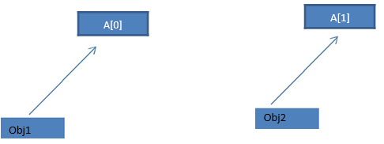

# C++ SMI5  

## Join this link

## https://app.sli.do/event/ex3esarj


---

## First Class

---

```cpp
    class Abc
    {
        int i;           //data variable
        void display()         //Member Function
        { 
            cout << "Inside Member Function";
        }
    }; // Class ends here

    int main()
    {
        Abc obj;  // Creatig Abc class's object
        obj.display();  //Calling member function using class object
    }
```

---

## Data Types

---

### Built-in Data Types

```cpp
    char a = 'A';          // character type
    int a = 1;             // integer type
    float a = 3.14159;     // floating point type 
    double a = 6e-4;       // double type (e is for exponential)
```

---

## User Defined

---

## Modifiers in C++

---

* **long** and short modify the maximum and minimum values that a data type will hold.
* A plain **int** must have a minimum size of **short**.
* Size hierarchy : **short** int < int < **long** int
* Size hierarchy for floating point numbers is : float < double < **long** double
* **long** float is not a legal type and there are no **short** floating point numbers.
* **Signed** types includes both positive and negative numbers and is the **default type**.
* **Unsigned**, numbers are always without any sign, that is always positive.

---


---

## Scope of Variables

---
<!--
Global variables are those, which ar once declared and can be used throughout the lifetime of the program by any class or any function. They must be declared outside the main() function. If only declared, they can be assigned different values at different time in program lifetime. But even if they are declared and initialized at the same time outside the main() function, then also they can be assigned any value at any point in the program.

For example: Only declared, not initialized

 -->

### Global variables

```cpp
    #include <iostream>
    using namespace std;
    int x;                // Global variable declared
    int main()
    {
        x=10;                 // Initialized once
        cout <<"first value of x = "<< x;
        x=20;                 // Initialized again
        cout <<"Initialized again with value = "<< x;
    }
```

---

### Local Variables

<!-- 
Local variables are the variables which exist only between the curly braces, in which its declared. Outside that they are unavailable and leads to compile time error.

 -->

```cpp
    #include <iostream>
    using namespace std;
    int main()
    {
        int i=10;
        if(i<20)        // if condition scope starts
        {
            int n=100;   // Local variable declared and initialized
        }              // if condition scope ends
        cout << n;      // Compile time error, n not available here
    }
```

---

### Special types of variable

    #include <iostream.h>
    using namespace std;
    int main()
    {
        final int i=10;
        static int y=20;
    }

---

## Types of operators

* Assignment Operator **=**
* Mathematical Operators **+ * / - %**
* Relational Operators **< > <= >= != ==**
* Logical Operators **&&** **||**
* Bitwise Operators **& | ^ ~**
* Shift Operators **>> << >>>**
* Unary Operators **++ -- & * new delete ~ ! - +**
* Ternary Operator **condition? ifConditionTrue:ifConditionFalse**
* Comma Operator int a,b,c;

---

* typedef
* sizeof

---

```cpp
    //Define a new type
    typedef int* IntPtr ;
    IntPtr x, y, z;

    cout << sizeof(double);   //Will print size of double
```

---

## Decision making

---

```cpp
    if(expression 1)
    {
        statement-block1;
    }
    else if(expression 2) 
    {
        statement-block2;
    }
    else if(expression 3 ) 
    {
        statement-block3;
    }
    else 
        default-statement;
```

---

```cpp
    int a = 5;
    if(a > 4)
        cout << "success";
```

---

## Loops

---

### While

```cpp
    variable initialization;
    while (condition)
    {
        statements;
        variable increment or decrement; 
    }
```

---

### Do While

```cpp
    do
    {
        // a couple of statements
    }
    while(condition);
```

---

### For

```cpp

    for(initialization; condition; increment/decrement)
    {
        statement-block;
    }
```

---

#### break

#### continue

---

## Storage Classes

---

### Global variables in C++

These are defined at the starting , before all function bodies and are available throughout the program.

```cpp
    using namespace std;
    int globe;      // Global variable
    void func();
    int main()
    {
        .....
    }
```

---

### Local variables

They are defined and are available within a particular scope. They are also called **Automatic variable** because they come into being when scope is entered and automatically go away when the scope ends.

The keyword **auto** is used, but by default all local variables are auto, so we don't have to explicitly add keyword auto before variable dedaration. Default value of such variable is **garbage**.

---

### Register variables

This is also a type of local variable. This keyword is used to tell the compiler to make access to this variable as fast as possible. Variables are stored in registers to increase the access speed.

But you can never use or compute **address of register variable** and also , a register variable can be declared only within a **block**, that means, you cannot have global or static register variables.

---

### Static variables

Static variables are the variables which are initialized & allocated storage only once at the beginning of program execution, no matter how many times they are used and called in the program. A static variable retains its value until the end of program.

---

```cpp
    void fun()
    {
        static int i = 10;
        i++;
        cout << i;
    }
    int main()
    {
        fun();      // Output = 11
        fun();      // Output = 12
        fun();      // Output = 13
    }

```

---

As, `i` is static, hence it will retain its value through function calls, and is initialized only once at the beginning.

Static specifiers are also used in classes, but that we will learn later.

---

### Extern variables

This keyword is used to access variable in a file which is declared & defined in some other file, that is the existence of a global variable in one file is declared using extern keyword in another file.


---

## Functions

---

### Call by Address (*Pointer)

In this we pass the address of the variable as arguments. In this case the formal parameter can be taken as a reference or a pointer, in both the case they will change the values of the original variable.

```cpp
        void calc(int *p);

        int main()
        {
            int x = 10;
            calc(&x);     // passing address of x as argument
            printf("%d", x);
        }

        void calc(int *p)
        {
            *p = *p + 10;
        }
```

---

### Call by Value

In this calling technique we pass the values of arguments which are stored or copied into the formal parameters of functions. Hence, the original values are unchanged only the parameters inside function changes.

```cpp
        void calc(int x);

        int main()
        {
            int x = 10;
            calc(x);
            printf("%d", x);
        }

        void calc(int x)
        {
            x = x + 10 ;
        }
```

---

### Cal by Reference (&)

In this calling technique we pass the reference of the arguments which apply all the changes to the passed value, any change applied will affect the original value of the argument.

---

```cpp
        void calc(int &x);
        int main(){
            int x = 10;
            calc(x);
            printf("%d", x);
        // Will print 20;
        }
        void calc(int &x){
            x = x + 10 ;
        }
```

---
<!-- 
mli katmchi 3nd lkhedar ou kathez matalan chi maticha wlla btata, wkatguoul lih 3ber li kilo mn hadi,
gha katwerih dakchi li 3ndek
ach kaydir houwa kaymchi yhez wa7ed sella wkaybda y3mer fiha b7al dakchi li nta haz,
ma9assch lik dakchi li fyeddik ou mli ghadi y3tik dakchi li fi lmika maghadi ykoun bedel walou fi dakchi li werritih nta,
donc mcha creea wa7ed lvariable jdida ou bda kaybedel fiha

amma ila 3titih wa7ed sella ta3 btata matalan, ou guelti lih dir li kilo, ghadi ybda yn9ess w yziid fi dik sella tayl9a l3bar,
y9der yred lik sella "return type reference?pointeur"
y9der yred lik dakchi li fi sella ydirou lik fchi mika "return type value"
ou t9der gua3 ytnadem m3ak l7al w mayred lik walou "void"

ila jab lah returna lik sella l existance ta3 dik lvaleur fi ram katb9a, machi b7al ila knti declariti chi valeur, w mareturnitich liha reference ta3ha, kay9telha lcompilateur
-->

### Reference vs Variable

It is used as a replacement to the call by value if used with the *const* prefix like:

```cpp
    void calc(const int &x);
```

---

### Reference vs Pointers

References are often confused with pointers but three major differences between references and pointers.

* You cannot have **NULL** references. You must always be able to assume that a reference is connected to a legitimate piece of storage.
* Once a reference is initialized to an object, it cannot be changed to refer to another object. Pointers can be pointed to another object at any time.
* A reference must be initialized when it is created. Pointers can be initialized at any time.

---

### Exercise

---
<!-- 
+ right, return new value in a new memory case
= left first, needs a reference/poitur at the left position, then proceed to look for a value or ref at the right it stops looking when it finds a ;

-->

```cpp
    #include<iostream>
    using namespace std;
    int x=6;
    int h(int& x){x=2*x; return x;}
    int &f(int &x){x+=::x; return x;}
    int main(){
        int x = -1;
        f(::x) = h(x);
        cout<<f(x) << " "<<g(x)<<"  "<<h(x)<<"  "<<x<<" "<<::x<<endl;
    }

```

---

## Class

---

### Access Control

---

#### Public Access Modifier

Public, means all the class members declared under **public** will be available to everyone. The data members and member functions declared public can be accessed by other classes too. Hence there are chances that they might change them. So the key members must not be declared public.

```cpp
    class PublicAccess
    {
        // public access modifier
        public:   
        int x;            // Data Member Declaration 
        void display();   // Member Function decaration
    }
```

---

#### Private Access Modifier

Private keyword, means that no one can access the class members declared **private**, outside that class. If someone tries to access the private members of a class, they will get a **compile time error**. By default class variables and member functions are private.

```cpp
    class PrivateAccess
    {
        // private access modifier
        private:   
        int x;            // Data Member Declaration 
        void display();   // Member Function decaration
    }

```

---

### Protected Access Modifier

Protected, is the last access specifier, and it is similar to private, it makes class member inaccessible outside the class. But they can be accessed by any subclass of that class. (If class A is **inherited** by class B, then class B is subclass of class A. We will learn about inheritance later.)

```cpp
    class ProtectedAccess
    {
        // protected access modifier
        protected: 
        int x;            // Data Member Declaration 
        void display();   // Member Function decaration
    }

```

---

### Functions And Methods

---

#### Member Functions

```cpp
    class Cube
    {
        public:
        int side;
        int getVolume()
        {
            return side*side*side;      //returns volume of cube
        }
    };
```

---

```cpp
    class Cube
    {
        public:
        int side;
        int getVolume();
    }

    // member function defined outside class definition
    int Cube :: getVolume()
    {
        return side*side*side;
    }
```

---

#### Friend Functions

```cpp
    class WithFriend{
        int i;
        public:
        friend void fun(); // global function as friend
    };
    void fun(){
        WithFriend wf;
        wf.i=10;  // access to private data member
        cout << wf.i;
    }
    int main(){
        fun(); //Can be called directly
    }
```

---

```cpp
    class Other{
        void fun();
    };

    class WithFriend{
        private:
        int i;
        public:
        void getdata();  // Member function of class WithFriend
        // making function of class Other as friend here
        friend void Other::fun();   
        // making the complete class as friend
        friend class Other;  
    };
```

---

Friend Functions is a reason, why C++ is not called as a pure Object Oriented language. Because it violates the concept of Encapsulation.

---

### Inline Functions

Inline functions are actual functions, which are copied everywhere during compilation, like preprocessor macro, so the overhead of function calling is reduced. All the functions defined inside class definition are by default inline, but you can also make any non-class function inline by using keyword **inline** with them.

---

For an inline function, declaration and definition must be done together. For example,

```cpp
    inline void fun(int a) 
    { 
        return a++; 
    }
```

---

#### **Some Important points about Inline Functions**

1. We must keep inline functions small, small inline functions have better efficiency.
2. Inline functions do increase efficiency, but we should not make all the functions inline. Because if we make large functions inline, it may lead to **code bloat**, and might affect the speed too.
3. Hence, it is adviced to define large functions outside the class definition using scope resolution `::` operator, because if we define such functions inside class definition, then they become inline automatically.
4. Inline functions are kept in the Symbol Table by the compiler, and all the call for such functions is taken care at compile time.

---

##### **Limitations of Inline Functions**

1. Large Inline functions cause Cache misses and affect performance negatively.
2. Compilation overhead of copying the function body everywhere in the code on compilation, which is negligible for small programs, but it makes a difference in large code bases.
3. Also, if we require address of the function in program, compiler cannot perform inlining on such functions. Because for providing address to a function, compiler will have to allocate storage to it. But inline functions doesn't get storage, they are kept in Symbol table.

---

### Overloading

```cpp
    // first definition
    int sum(int x, int y=0){
        cout<< x+y;
    }
    // second overloaded defintion
    double sum(double x, double y){
        cout << x+y;
    }
    int main(){
        sum (10,20);
        sum(10.5,20.5);
    }
```

---

### Overriding

Check inheritance

---

## Inheritance

---

### Example

```cpp
    class Animal{ 
        public:
        int legs = 4;
    };
    // Dog class inheriting Animal class
    class Dog : public Animal{ 
        public:
        int tail = 1;
    };
    int main(){
        Dog d;
        cout << d.legs;
        cout << d.tail;
    }
```

---

### Visibility

|   |   |   |   |   |
|---|---|---|---|---|
| Base class  |   |   |   |   |
| Private  |   |   |   |   |
|  Protected |   |   |   |   |
|  Public |   |   |   |   |

<!-- [Table showing all the Visibility Modes](https://www.notion.so/a926b086c93f4c2b8fb5796e5fa7abee) -->

---

#### Public Inheritance

This is the most used inheritance mode. In this the protected member of super class becomes protected members of sub class and public becomes public.

```cpp
    class Subclass : public Superclass
```

---

#### Private Inheritance

In private mode, the protected and public members of super class become private members of derived class.

```cpp
    class Subclass : Superclass   // By default its private inheritance
```

---


#### Protected Inheritance

In protected mode, the public and protected members of Super class becomes protected members of Sub class.

```cpp
    class subclass : protected Superclass
```

---

### Types of Inheritance

---

#### Single Inheritance

In this type of inheritance one derived class inherits from only one base class. It is the most simplest form of Inheritance.


---

#### Multiple Inheritance

---

In this type of inheritance a single derived class may inherit from two or more than two base classes.


---

#### Hierarchical Inheritance

In this type of inheritance, multiple derived classes inherits from a single base class.


---

#### Multilevel Inheritance

In this type of inheritance the derived class inherits from a class, which in turn inherits from some other class. The Super class for one, is sub class for the other.


---

#### Hybrid (Virtual) Inheritance

Hybrid Inheritance is combination of Hierarchical and Mutilevel Inheritance.


---

#### Points to Remember

* Whether derived class's default constructor is called or parameterised is called, base class's default constructor is always called inside them.

* To call base class's parameterised constructor inside derived class's parameterised constructo, we must mention it explicitly while declaring derived class's parameterized constructor.

---

#### Base class Default Constructor in Derived class Constructors

```cpp
    class Base
    { 
        int x;
        public:
        // default constructor
        Base() 
        { 
            cout << "Base default constructor\n"; 
        }
    };
```

---

```cpp
    class Derived : public Base
    { 
        int y;
        public:
        // default constructor
        Derived() 
        { 
            cout << "Derived default constructor\n"; 
        }
        // parameterized constructor
        Derived(int i) 
        { 
            cout << "Derived parameterized constructor\n"; 
        }
    };
```

---

```cpp
    int main()
    {
        Base b;        
        Derived d1;    
        Derived d2(10);
    }
```

---

```bash
    1/ Base default constructor
    2/ Base default constructor
    3/ Derived default constructor
    4/ Base default constructor
    5/ Derived parameterized constructor
```

<!-- 
bnssba ll destructor, akhir 7aja tcreeat hya awal 7aja bach kaybda lgarbage collector mli kaybghi ybda yne99i la ram mn be3d ma kayssali l execution
-->

---

#### Base class Parameterized Constructor in Derived class Constructor

```cpp
    class Base
    { 
        int x;
        public:
        // parameterized constructor
        Base(int i)
        { 
            x = i;
            cout << "Base Parameterized Constructor\n";
        }
    };
```

---

```cpp
    class Derived : public Base
    { 
        int y;
        public:
        // parameterized constructor
        Derived(int j):Base(j)
        { 
            y = j;
            cout << "Derived Parameterized Constructor\n";
        }
    };
```

---

```cpp
    int main()
    {
        Derived d(10) ;
    }
```

---

#### Why is Base class Constructor called inside Derived class?

Constructors have a special job of initializing the object properly. A Derived class constructor has access only to its own class members, but a Derived class object also have inherited property of Base class, and only base class constructor can properly initialize base class members. Hence all the constructors are called, else object wouldn't be constructed properly.

---

#### **Constructor call in Multiple Inheritance in C++**

Its almost the same, all the Base class's constructors are called inside derived class's constructor, in the same order in which they are inherited.

```cpp
    class A : public B, public C;
```

In this case, first class B constructor will be executed, then class C constructor and then class A constructor.

---

#### Functions that are never Inherited

* Constructors and Destructors are never inherited and hence never overrided.

* Also, assignment operator = is never inherited. It can be overloaded but can't be inherited by sub class.

---

#### Inheritance and Static Functions in C++

They are inherited into the derived class.
If you redefine a static member function in derived class, all the other overloaded functions in base class are hidden.
Static Member functions can never be virtual.


---

## Polymorphism

### Definition

Polymorphism means having multiple forms of one thing. In inheritance, polymorphism is done, by method overriding, when both super and sub class have member function with same declaration but different definition.

---

## Operators Overriding


---

<!-- Fin ghadyin les donnes
cout << donnes
cin >> a >> b

b7al toString ta3 java
 -->

### Operator <<

```cpp
    #include<iostream.h>
    using namespace std;
    class Time{
        int hr, min, sec;
        public:
        Time(){
            hr=0, min=0; sec=0;
        }        
        Time(int h, int m, int s){
            hr=h, min=m; sec=s;
        }
        friend ostream& operator << (ostream &out, Time &tm); 
    };
    // define the overloaded function
    ostream& operator << (ostream &out, Time &tm){
        out << "Time is: " << tm.hr << " hour : " << tm.min << " min : " << tm.sec << " sec";
        return out;
    }
```

---

```cpp
    void main(){
        Time tm(3,15,45);
        cout << tm;
    }
```

---

### Operator ==

---

```cpp
    class Time{
        int hr, min, sec;
        public:
        Time(){
            hr=0, min=0; sec=0;
        }
        Time(int h, int m, int s){
            hr=h, min=m; sec=s;
        }
        //overloading '==' operator
        friend bool operator==(Time &t1, Time &t2);
    };
    bool operator== (Time &t1, Time &t2){
        return ( t1.hr == t2.hr && t1.min == t2.min && t1.sec == t2.sec );
    }

```

---

```cpp
    void main(){
        Time t1(3,15,45);
        Time t2(4,15,45);
        if(t1 == t2){
            cout << "Both the time values are equal";
        }  else {
            cout << "Both the time values are not equal";
        }
    }
```

<!--

Defining the overloading operator function
Here we are simply comparing the hour, minute and
second values of two different Time objects to compare
their values
-->

---

### Operator +

```cpp
    #include <iostream.h>
    #include <conio.h>
    class Time{
        int h,m,s;
        public:
        Time(){
            h=0, m=0; s=0;
        }
        void setTime();
        void show(){
            cout<< h<< ":"<< m<< ":"<< s;
        }

        //overloading '+' operator
        Time operator+(time);   
    };
```

---

```cpp
    Time Time::operator+(Time t1){//operator function
        Time t;
        int a,b;
        a = s+t1.s;
        t.s = a%60;
        b = (a/60)+m+t1.m;
        t.m = b%60;
        t.h = (b/60)+h+t1.h;
        t.h = t.h%12;
        return t;
    }

    void time::setTime()
    {
        cout << "\n Enter the hour(0-11) ";
        cin >> h;
        cout << "\n Enter the minute(0-59) ";
        cin >> m;
        cout << "\n Enter the second(0-59) ";
        cin >> s;
    }
```

---

```cpp
    void main()
    {
        Time t1,t2,t3;
    
        cout << "\n Enter the first time ";
        t1.setTime();
        cout << "\n Enter the second time ";
        t2.setTime();
        t3 = t1 + t2;	//adding of two time object using '+' operator
        cout << "\n First time ";
        t1.show();
        cout << "\n Second time ";
        t2.show();
        cout << "\n Sum of times ";
        t3.show();
        getch();
    }
```

---

### Copy Constructor vs. Assignment Operator (=)

---

Assignment operator is used to copy the values from one object to another already existing object. For example:

```cpp
    Time tm(3,15,45); // tm object created and initialized
    Time t1;    // t1 object created
    t1 = tm;    // initializing t1 using tm
```

---

Whereas, Copy constructor is a special constructor that initializes a new object from an existing object.

```cpp
    Time tm(3,15,45); // tm object created and initialized
    Time t1(tm);    //t1 object created and initialized using tm object
```

In case of Copy constructor, we provide the object to be copied as an argument to the constructor. Also, we first need to define a copy constructor in our class.

---

## Copy Constructor types

---

### Simple

---

```cpp
    #include<iostream>
    using namespace std;
    class Samplecopyconstructor{
        private:
        int x, y;   //data members
        public:
        Samplecopyconstructor(int x1, int y1){
            x = x1;
            y = y1;
        }
        /* Copy constructor */
        Samplecopyconstructor (const Samplecopyconstructor &sam){
            x = sam.x;
            y = sam.y;
        }
        void display(){
            cout<<x<<" "<<y<<endl;
        }
    };

```

---

```cpp
    /* main function */
    int main()
    {
        Samplecopyconstructor obj1(10, 15);     // Normal constructor
        Samplecopyconstructor obj2 = obj1;      // Copy constructor
        cout<<"Normal constructor : ";
        obj1.display();
        cout<<"Copy constructor : ";
        obj2.display();
        return 0;
    }
```

---

### Shallow Copy Constructor


---

```cpp
    #include<iostream>
    #include<cstring>
    using namespace std;
    class CopyConstructor{
        char *s_copy;
        public:
        CopyConstructor(const char *str){
            s_copy = new char[16]; //Dynamic memory allocation
            strcpy(s_copy, str);
        }
        /* concatenate method */
        void concatenate(const char *str){
            strcat(s_copy, str); //Concatenating two strings
        }
        /* copy constructor */
        ~CopyConstructor (){ 
            delete [] s_copy;
        }
        void display(){
            cout<<s_copy<<endl;
        }
    };
```

---

```cpp
    /* main function */
    int main()
    {
        CopyConstructor c1("Copy");
        CopyConstructor c2 = c1; //Copy constructor
        c1.display();
        c2.display();
        c1.concatenate("Constructor");    //c1 is invoking concatenate()
        c1.display();
        c2.display();
        return 0;
    }
```

---

### Deep Copy Constructor



---

```cpp
    #include<iostream>
    #include<cstring>
    using namespace std;
    class CopyConstructor{
        char *s_copy;
        public:
        CopyConstructor (const char *str){
            s_copy = new char[16];  //Dynamic memory alocation
            strcpy(s_copy, str);
        }
        CopyConstructor (const CopyConstructor &str){
            s_copy = new char[16]; //Dynamic memory alocation
            strcpy(s_copy, str.s_copy);
        }
        void concatenate(const char *str)
        {
            strcat(s_copy, str); //Concatenating two strings
        }
        ~CopyConstructor(){ 
            delete [] s_copy;
        }
        void display(){
            cout<<s_copy<<endl;
        }
    };
```

---

```cpp
    /* main function */
    int main()
    {
        CopyConstructor c1("Copy");
        CopyConstructor c2 = c1;    //copy constructor
        c1.display();
        c2.display();
        c1.concatenate("Constructor");    //c1 is invoking concatenate()
        c1.display();
        c2.display();
        return 0;
    }

```

---

References:
[https://www.studytonight.com/cpp/introduction-to-cpp.php]